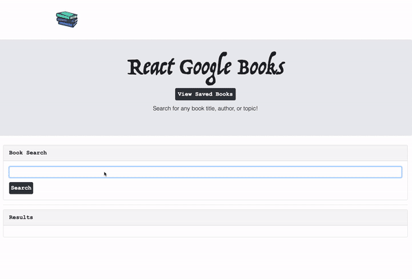

# React Google Books :books:

React-based Google Books Search app that returns book data from the Google Books API. It uses Node, Express as the backend and MongoDB to save books for review or purchase later.




Deployed Application:
http://react-express-books-api.herokuapp.com/

### Technologies Used
- React
- React Router 4
- Axios
- NodeJS
- ExpressJS
- MongoDB
- Boostrap
- Google Books API


## Create React Express App

### About This Boilerplate

This setup allows for a Node/Express/React app which can be easily deployed to Heroku.

The front-end React app will auto-reload as it's updated via webpack dev server, and the backend Express app will auto-reload independently with nodemon.

### Installation

- Clone GibHub Repo

- Install front and backend dependencies. While in this directory, run the following command:

```
npm install
```

This should install node modules within the server and the client folder.

After both installations complete, run the following command in your terminal:

```
npm start
```

Your app should now be running on <http://localhost:3000>. The Express server should intercept any AJAX requests from the client.
